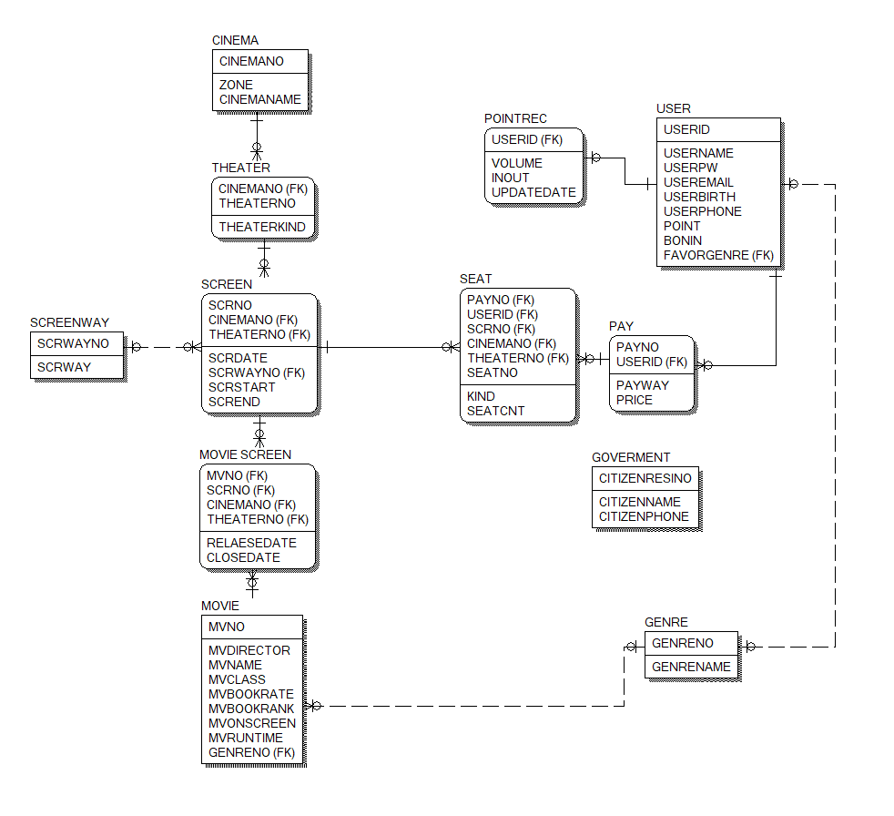

## 0506 log 업데이트

SCREEN TABLE의 ZONE CINEMA로 변경

THEATER TABLE의 SCRSTART, SCREND 제거(한 상영관당 한번밖에 상영할 수 없게됨)

SCREEN TABLE에 SCRSTART, SCREND 인계하고 CINEMANO, THEATERNO FK로 받음

USER TABLE에 BONIN 본인인증 여부 추가

POINT TABLE에 가격(VOLUME), INOUT(포인트 사용인지 획득인지 여부), UPDATEDATE(갱신날짜와시간) 추가

SEATNUM->SEATNO 변경
SCREENWAY의 PRIMARY KEY 값 SCRNO가 SCREEN TABLE의 상속에서 문제되어 SCRWAYNO로 이름변경

SEAT TABLE로 병합되는 형태라 SEAT TABLE을 새로 생성하고 TICKET TABLE 재생성

PAY-SEAT-SCREEN의 관계 대대적으로 수정
쿼리 생성시 SEAT에 있는 PAYNO를 찾아서 KINDNAME과 SEATCNT, SEATNO를 전부 찾아 좌석 배치하면 될듯.(기존의 SEAT는 성인과 청소년이 함께 관람할 수 없었음)

CINEMA-THEATER-SCREEN 관계 수정
계층적관계로 구성하여 SCREEN에서는 CINEMANO, THEATERNO를 모두 포함

MOVIE-SCREEN 관계 수정
M:N 관계가 형성됨에 따라 MOVIE-SCREEN TABLE을 생성하여 어트리뷰트에 개봉날짜와 사영 종료날짜 추가.

GOVERMENT TABLE 추가
본인인증 쿼리 사용시를 위해 주민등록번호, 이름, 전화번호를 갖는 테이블 생성.
비회원 결제시 임시 USERID 생성후 USERBIRTH, USERNAME, USERPHONE과 GOVERMENT 테이블에서 전부 일치하는 컬럼을 찾으면 임시 USERID의 BONIN을 참으로 변경 후 PAY 테이블에 USERID인계.