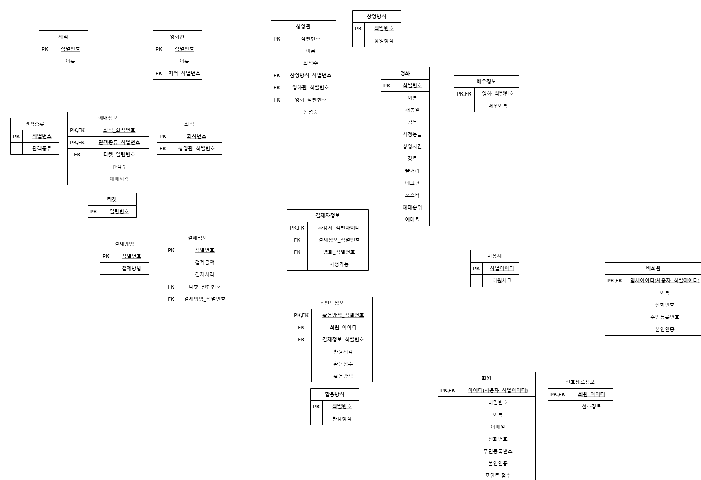

# 정규형(Normal Form)의 분류

    제 1 정규형(first normal form)
    제 2 정규형(second normal form)
    제 3 정규형(third normal form)
    BCNF (Boyce-Codd normal form)
    ---- 여기까지 구현 ----
    제 4 정규형(forth normal form)
    제 5 정규형(fifth normal form)

    역정규화(=반정규화, denormalization)

***
## 릴레이션 분해

- 하나의 릴레이션을 두 개 이상의 릴레이션으로 나누는 것
- 릴레이션을 분해하면 중복이 감소되고 갱신 이상이 줄어드는 장점이 있는 반면에, 바람직하지 않는 문제들을 포함하여 몇가지 잠재적인 문제들을 야기할 수 있음
  - 릴레이션이 분해되기 전에는 조인이 필요없는 질의가 분해 후에 조인을 필요로 하는 질의로 바뀔 수 있음
  - 분해된 릴레이션들을 사용하여 원래 릴레이션을 재구성하지 못할 수 있음

***
## 제 1 정규형

- 한 릴레이션의 모든 애트리뷰트가 원자값만 갖는다는 것
- 즉 릴레이션의 모든 애트리뷰트에 반복그룹이 나타나지 않는 것

***
## 제 2 정규형

- 한 릴레이션이 제 1 정규형을 만족하면서, 어떤 후보 키에도 속하지 않는 모든 애트리뷰트들이 릴레이션의 기본 키에 완전하게 함수적으로 종속하는 것
- 기본 키가 두 개 이상의 애트리뷰트로 구성되었을 경우에만 고려할 필요가 있음

***
## 제 3 정규형

- 한 릴레이션이 제 2 정규형을 만족하면서, 키가 아닌 모든 애트리뷰트가 릴레이션의 기본 키에 이행적을 종속하지 않는 것

***
## BCNF

- 한 릴레이션이 제 3 정규형을 만족하면서, 모든 결정자가 후보 키이여야 함
- 제 3 정규형을 만족하는 대부분의 릴레이션들은 BCNF도 만족함
- 키가 아니면서 결정자 역할을 하는 애트리뷰트와 그 결정자에 함수적으로 종속하는 애트리뷰트를 하나의 릴레이션에 넣고, 결정자는 기본 키가 됨.
- 그 다음, 기존 릴레이션에 결정자를 남겨 기본 키의 구성요소가 되도록 하며, 이 결정자는 새로운 릴레이션의 외래키 역할임

***
## 역정규화

- 정규화 단계가 진행될수록 중복이 감소하고 갱신 이상도 감소되며, 따라서 필요한 코드의 양도 감소됨
- 정규화가 데이터베이스 설계의 중요한 요소지만 성능상의 관점에서만 보면 높은 정규형을 만족하는 릴레이션 스키마가 최적은 아님
- 분해된 릴레이션을 대상으로 질의할 때, 같은 정보를 얻기위해서 많은 릴레이션들에 접근해야 하므로, 조인의 필요성이 증가
- 때로 데이터 중복 및 갱신 이상을 대가로 치르면서 성능상의 요구를 만족시키기도 함
- 즉 역정규화는 낮은 정규형으로 되돌아가는 것

