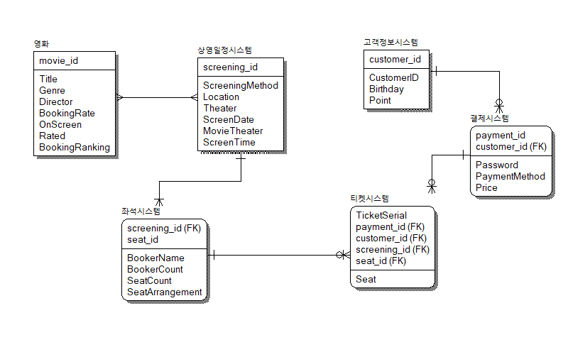

### erwin 초기 구상

* 상영일자와 방문일자 중복으로 제거
* 고객정보시스템의 금액-> 결제시스템의 금액으로 변환
* 영화:상영일정시스템 M:N관계 해소 안한상태
* 티켓에 결제정보, 상영정보(영화정보 포함), 좌석정보, 고객정보가 포함된 상태이므로 
  고객정보시스템의 고객, 회원, 비회원, 영수증, 티켓정보, 좌석정보 누락

--

더 생각해 보기

* 상영일정 시스템과 좌석시스템 관계 모호?
* 회원/비회원 여부 -> Nullable한 customerID의 여부로 판단?