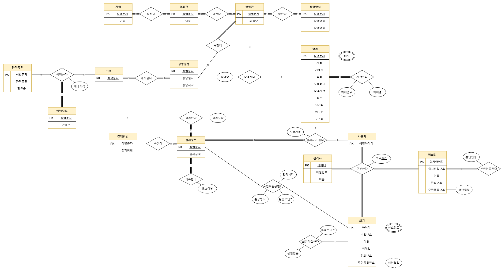
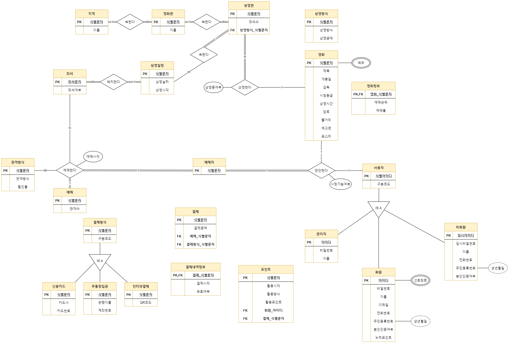
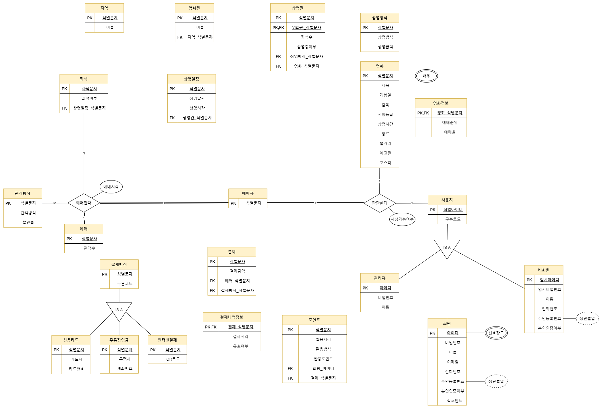
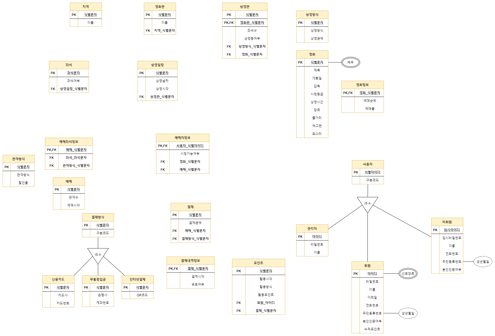
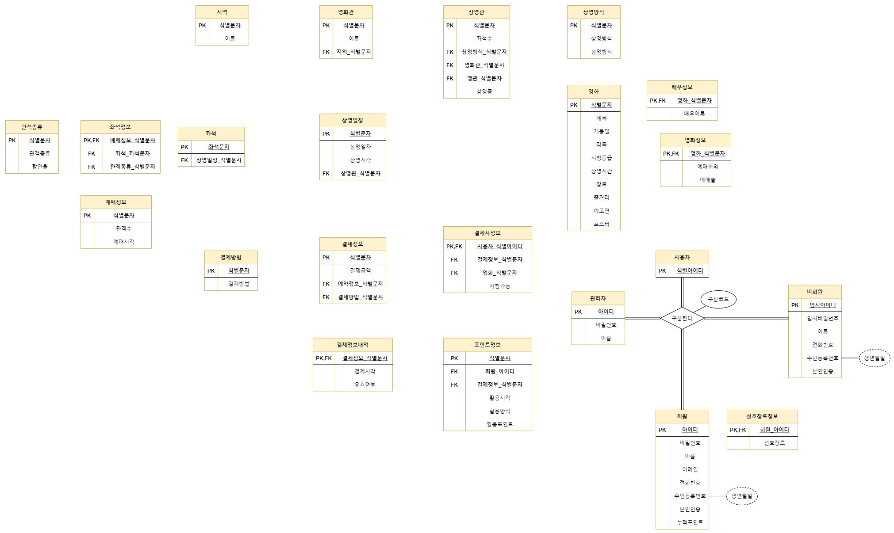
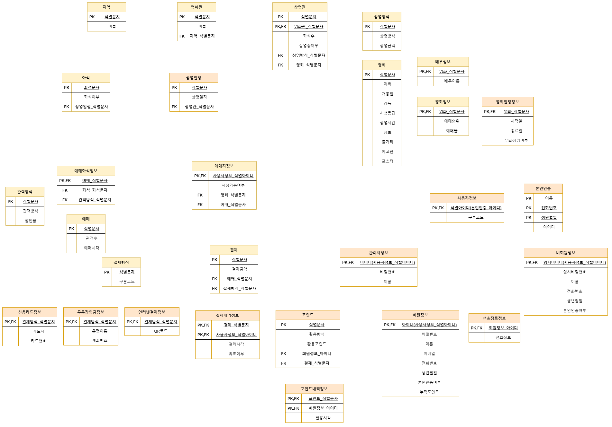
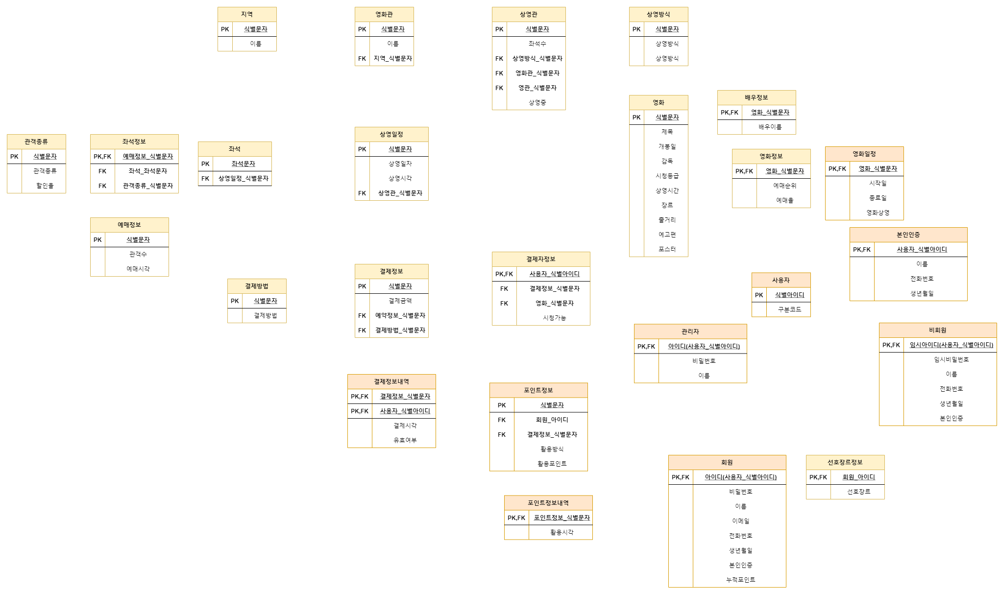

# ER 스키마를 관게 모델의 릴레이션으로 사상

    1 단계 : 정규 엔티티 타입
    2 단계 : 약한 엔티티 타입
    3 단계 : 2진 1:1 관계 타입
    4 단계 : 정규 2진 1:N 관계 타입
    5 단계 : 2진 M:N 관계 타입
    6 단계 : 3진 관계 타입
    7 단계 : 다치 애트리뷰트

***
## ERD
.png)
***
## 1 단계 : 정규 엔티티 타입

***
## 2 단계 : 약한 엔티티 타입
***
## 3 단계 : 2진 1:1 관계 타입

### 추가설명
1. 결제와 결제내역정보 테이블 설계
***
## 4 단계 : 정규 2진 1:N 관계 타입

### 추가설명
1. 상영관에서 왜 영화관_식별문자가 PK인지
***
## 5 단계 : 2진 M:N 관계 타입
***
## 6 단계 : 3진 관계 타입

### 추가설명
1. 예매좌석정보와 예매자정보 설명
***
## 7 단계 : 다치 애트리뷰트

***
## 그외에 정규화

### 추가설명
1. 색칠된 테이블 추가설명
***
## VIEW 추가
